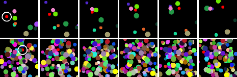

# Backpropagation Kalman filter

This repository is an implementation of the Backpropagation Kalman filter algorithm (BKF) for the synthetic visual state estimation task experiment. The algorithm and experiment are described in the paper [Backprop KF: Learning Discriminative Deterministic State Estimators](https://arxiv.org/abs/1605.07148) [1]. 



*Example of a sequence of frames of moving circles. The objective is to track the position of the red circle. 
There are 10 circles in the upper sequence and 100 circles in the bottom sequence.* [1]

This code was written for a reproduction study of which the paper is available in [paper](paper.pdf) (in Dutch).

Parts of the code are inspired by or taken from [2] and [3].


## Requirements

To install requirements:
```setup
pip install -r requirements.txt
```


## Dataset generation
Generates datasets (sequences of frames of moving circles as shown above) for the experiment. 

```generation
python CircleGenerator.py <nr_of_sequences> <sequence_length> <nr_of_circles> <type> <model> <change_shape>
```
 * `<nr_of_sequences>`: amount of sequences in a dataset
 * `<sequence_length>`: amount of frames in a sequence
 * `<nr_of_circles>`: amount of circles in each frame
 * `<type>`: `training` or `validation` or `test`
 * `<model>`:  for which model to use: `ff` for the feedforward model, 
`bkf` for the backpropagation Kalman filter model.
 * `<change_shape>`: whether the used datasets should be circles changing in shape or not; choose `change_shape` for circles changing shape, any other value will use not changing circles

Example:
```generationexample
python CircleGenerator.py 100 100 1 train ff no_change_shape
```


## Training

For training the feedforward model only [I](#i-feedforward-model) needs te be done. For training the BKF model 
[I](#i-feedforward-model), [II](#ii-feedforward-model-with-variance) and [III](#iii-bkf) need te be done in this order.

Note that the `train` and `validation` datasets need to be generated beforehand as mentioned in 
[Dataset generation](#dataset-generation).

### General options for training
| Option | Meaning |
| --- | --- |
|`<nr_of_sequences_train>`| amount of sequences in a training dataset |
|`<sequence_length_train>`| amount of frames in a sequence of the training dataset |
 | `<nr_of_sequences_val>`| amount of sequences in a validation dataset |
 | `<sequence_length_val>`| amount of frames in a sequence of the validation dataset |
 | `<nr_of_circles>` |  amount of circles in each frame |
 | `<change_shape>` |  whether the used datasets should be circles changing shape or not; choose `change_shape` for circles changing shape, any other value will use not changing circles|
 | `<nr_of_epochs>` | amount of epochs to train the model |
 | `<batch_size>` | amount of sequences used in one iteration |
 | `<lr>` | learning rate, in case of choosing learning rate scheduling (see next row) this is the maximum learning rate |
 | `<lr_sched>` | if `lr_sched` is provided, learning rate scheduling is applied for training; any other string does not enable learning rate scheduling |


### I Feedforward model

To train the feedforward model on the position of the red circle.

```train
python Position_FF.py <nr_of_sequences_train> <sequence_length_train> <nr_of_sequences_val> <sequence_length_val> <nr_of_circles> <change_shape> <nr_of_epochs> <batch_size> <lr> <lr_sched>
```

Look at [General options for training](#general-options-for-training)
for the meaning of these options.

Example
```trainex1
python Position_FF.py 100 100 50 100 1 change_shape 150 20 0.005 no_lr_sched
```

After training, the model is saved in directory
```
logs/models/pos_ff/{changing_shape}=<nr_of_circles>/t_<nr_of_sequences_train>_<nr_of_sequences_val>_b_<batch_size>_loss_{loss_value}_{timestamp}/
```
with file name `lowest_val_loss.tar` and
 * `{changing_shape}`: `changing_circles` if `change_shape` option was chosen, otherwise `circles`;
 * `{loss_value}`: the validation loss of the saved model;
 * `{timestamp}`: timestamp of when the model was done training. E.g. `24-05-2022_16-46`.

The covariance matrix R is saved in the same directory as `R.pt`.

### II Feedforward model with variance

To train the feedforward model on the position of the red circle and the variance on the error of the prediction.

```train
python Position_Variance_FF.py <nr_of_sequences_train> <sequence_length_train> <nr_of_sequences_val> <sequence_length_val> <nr_of_circles> <change_shape> <nr_of_epochs> <batch_size> <R_path> <lr> <lr_sched>
```
| Option | Meaning |
| --- | --- |
|`R_path`| path to the covariance matrix R generated in [I](#i-feedforward-model) |

Look at [General options for training](#general-options-for-training)
for the meaning of the other options.

Note that [I](#i-feedforward-model) needs te be done on the same dataset in order to train this feedforward model.

Example: 
```trainex1
python Position_Variance_FF.py 100 100 50 100 1 no_change_shape 150 25 logs/models/pos_ff/circles=1/t_100_v_50_b_20_loss_1164.658935546875_24-05-2022_16-46/R.pt 0.005 no_lr_sched
```

After training, the model is saved in directory
```
logs/models/ff/{changing_shape}=<nr_of_circles>/t_<nr_of_sequences_train>_<nr_of_sequences_val>_b_<batch_size>_loss_{loss_value}_{timestamp}/
```
with file name `lowest_val_loss.tar` and
 * `{changing_shape}`: `changing_circles` if `change_shape` option was chosen, otherwise `circles`;
 * `{loss_value}`: the validation loss of the saved model;
 * `{timestamp}`: timestamp of when the model was done training. E.g. `24-05-2022_16-46`.
 
### III BKF
To train the BKF model on the position of the red circle.

```train
python BKF.py <nr_of_sequences_train> <sequence_length_train> <nr_of_sequences_val> <sequence_length_val> <nr_of_circles> <change_shape> <nr_of_epochs> <batch_size> <ff_model_path> <lr> <lr_sched>
```
 Option | Meaning |
| --- | --- |
|`ff_model_path`|path to the feedforward model trained in [III](#ii-feedforward-model-with-variance) |

Look at [General options for training](#general-options-for-training)
for the meaning of the other options.

Note that [II](#ii-feedforward-model-with-variance) needs to be done in order to have a pre-trained feedforward model.

Example: 
```trainex1
python BKF.py 100 100 50 100 1 150 25 logs/models/ff/circles=1/t_100_v_50_b_20_loss_1164.658935546875_24-05-2022_16-46/lowest_val_loss.tar 0.005
```

After training, the model is saved in directory
```
logs/models/bkf/{changing_shape}=<nr_of_circles>/t_<nr_of_sequences_train>_<nr_of_sequences_val>_b_<batch_size>_loss_{loss_value}_{timestamp}/
```
with file name `lowest_val_loss.tar` and
 * `{changing_shape}`: `changing_circles` if `change_shape` option was chosen, otherwise `circles`;
 * `{loss_value}`: the validation loss of the saved model;
 * `{timestamp}`: timestamp of when the model was done training. E.g. `24-05-2022_16-46`.


## Evaluation

The feedforward model ([I](#i-feedforward-model)) and BKF model ([III](#iii-bkf)) can be tested. 

Note that the `test` datasets need to be generated beforehand as mentioned in [Dataset generation](#dataset-generation).

In both cases the terminal shows the MSE Loss and RMSE Loss with its standard deviation. Example output:
```
Mean test loss
4.450648307800293
-------------
Root mean square error (RMSE) ± standard deviation
2.1096559690623238 ± 0.6460789442062378
```

### General options for testing
| Option | Meaning |
| --- | --- |
|`<nr_of_sequences_test>`| amount of sequences in a test dataset |
|`<sequence_length_test>`| amount of frames in a sequence of the test dataset |
 | `<nr_of_circles>` |  amount of circles in each frame |
 | `<change_shape>` |  whether the used datasets should be circles changing in shape or not; choose `change_shape` for circles changing shape, any other value will use not changing circles|
 | `<batch_size>` | amount of sequences used in one iteration |

### Feedforward
To test the feedforward model.

```eval
python Position_FF_testing.py <nr_of_sequences_test> <sequence_length_test> <nr_of_circles> <change_shape> <batch_size> <pos_ff_model_path>
```
| Option | Meaning |
| --- | --- |
|`pos_ff_model_path`| path to the feedforward model trained in [I](#i-feedforward-model) |

Look at [General options for testing](#general-options-for-testing)
for the meaning of the other options.

Example: 
```testex
python Position_FF_testing.py 50 100 1 change_shape 20 logs/models/pos_ff/circles=1/t_100_v_50_b_20_loss_1164.658935546875_24-05-2022_16-46/lowest_val_loss.tar
```

### BKF
To test the BKF model.

```eval
python BKF_testing.py <nr_of_sequences_test> <sequence_length_test> <nr_of_circles> <change_shape> <batch_size> <bkf_model_path>
```
| Option | Meaning |
| --- | --- |
|`bkf_model_path`| path to the BKF model trained in [III](#iii-bkf) |

Look at [General options for testing](#general-options-for-testing)
for the meaning of the other options.


## Results
Consult the paper for the results of training the feedforward model and BKF model 5 times with 1, 25, 50 and 100 circles.

## Authors

 * Sam Vervaeck - email: [sam.vervaeck@student.kuleuven.be](mailto:sam.vervaeck@student.kuleuven.be)
 * Tibo Van den Eede  - email: [tibo.vandeneede@student.kuleuven.be](mailto:tibo.vandeneede@student.kuleuven.be)


## License
This repository has an Apache 2.0 license, as found in the [LICENSE](LICENSE) file.


## Template
Template of this README comes from [Tips for releasing research code](https://github.com/paperswithcode/releasing-research-code/tree/master/templates) by Papers with code.


## References

[1] Tuomas Haarnoja, Anurag Ajay, Sergey Levine, and Pieter Abbeel. Backprop KF: learning
discriminative deterministic state estimators. *arXiv preprint arXiv:1605.07148*, 2016.

[2] Claire Chen and Richard Lin. Learning-based Visual Odometry on Ground Robot with Monocular
Camera. Technical report, 2019, URL: [https://github.com/ClaireLC/backprop_kf_vo](https://github.com/ClaireLC/backprop_kf_vo).

[3] Aakash Rao. Deep Learning with PyTorch: Zero to GANs, 2022. URL: [https://jovian.ai/learn/deep-learning-with-pytorch-zero-to-gans](https://jovian.ai/learn/deep-learning-with-pytorch-zero-to-gans).
